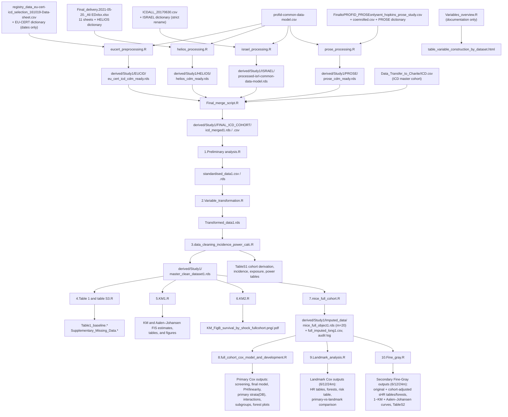

# Study 1 Data Flow

This note reconstructs the actual Study 1 preprocessing and analysis flow from
the numbered R scripts in `Study1/` and `Study1/preprocessing_dataset_scripts/`.
The clinical question is the association between first inappropriate ICD shock
(FIS) and all-cause mortality in an ICD cohort assembled from four registries:
EU-CERT-ICD, HELIOS, ISRAEL-ICD, and PROSE-ICD.

All file locations resolve through `Study1/study1_paths.R`:

- `profid_data_root()` = env `PROFID_DATA_ROOT`
  (default `/sc-projects/sc-proj-dhzc-profid/PROFID_Substudies/data`)
- `study1_derived_path(...)` = `<data_root>/derived/Study1/...`
  (env `PROFID_STUDY1_DERIVED_ROOT`)
- `study1_output_path(...)` = `<repo>/Study1/outputs/...`
  (env `PROFID_STUDY1_OUTPUT_ROOT`). Note: this helper keeps only the last
  path component when it has a file extension, so arguments like
  `"Supplementary_data", "Primary"` are discarded and all table/figure
  outputs of scripts 3–10 land flat in `Study1/outputs/`.

## Main Data Flow

## Step-By-Step Pipeline

| Step | Inputs read | Main transformations | Output written |
| --- | --- | --- | --- |
| `eucert_preprocessing.R` | `registry_data_eu-cert-icd_selection_161019-Data-sheet.csv`, EU-CERT dictionary xlsx (date columns only), shared `profid-common-data-model.csv` | Keeps ischemic diagnoses only; excludes age <18, CRT-D devices, and the Karolinska overlap centre; QC-compares date-derived follow-up against `length_fu_mortality` (flag only); `Status_death` from `death` yes/no with heart-transplant deaths reclassified as censored; `Time_death = length_fu_mortality`; `Status_FIS` from `inap_shock` yes/no; `Time_FIS = length_fu_inap_shock`; FIS/death-after-follow-up only flagged, not corrected; adds `DB = "CERT"`, `ID_f = "CERT-<ID>"` | `EUCID/eu_cert_icd_cdm_ready.rds/.csv`, QC summary CSV, basic summary xlsx |
| `helios_processing.R` | `Final_delivery.2021-05-20._Ali EDxlsx.xlsx` (11 sheets: `target_pop`, `Baseline Characteristics`, `Past Medical History (ICD10)`, `Past Medical History (OPS)`, `Medication (ATC)`, `Lab Data`, `ECG`, `ICD queries`, `Outcome`, `CMR-Scar and GZ`, `Imaging`), HELIOS dictionary csv | Outer-merges all sheets by `PAT_INDEX` (first row kept for multi-row Imaging); renames once via dictionary; excludes age <18 (CRT exclusion inactive); `Status_death` from `Status_death_cat` yes/no; `Time_death_days = DAYS2DEATH.ICD` for deaths, `DAYS2LastFU.ICD` for censored; `t_followup_days = Time_death_days`; `Status_FIS` from `inappropriate_shock`; `Time_FIS_days = DAYS2_inappropriate_shock.ICD` for exposed (censored FIS times stay NA due to a `Time_FIS`/`Time_FIS_days` typo); negatives set NA; adds `DB = "HELS"`, `ID_f = "HELS-<ID>"` | `HELIOS/helios_cdm_ready.rds/.csv`, QC summary CSV, basic summary xlsx |
| `israel_processing.R` | `ICDALL_20170630.csv`, ISRAEL dictionary xlsx (strict full-column rename) | Excludes age <18 (CRT exclusion inactive); for deceased patients aligns `Alive_last_FU_days` to `Alive_total_days` when death occurred after last follow-up; `Status_death = 1` iff `Status_last == "DIED"`; `Time_death_days = t_followup_days = Alive_last_FU_days`; `Status_FIS` from `Inapp_shock_1st` YES/NO; `Time_FIS_days = Inapp_shock_days` for exposed, else follow-up; actively reclassifies FIS after follow-up to unexposed and censors FIS time at follow-up; adds `DB = "ISRL"`, `ID_f = "ISRL_<ID>"` (underscore) | `ISRAEL/processed-isrl-common-data-model.rds`, `processed-ISRAEL-common-data-model.csv`, `qc-israel-preprocessing.csv`, `basic-data-summaries1-cdm.xlsx` |
| `prose_processing.R` | `FinaltoPROFID_PROSEonlysent_hopkins_prose_study.csv`, `FinaltoPROFID_PROSEonlysent_coenrolled.csv`, PROSE dictionary xlsx | Renames via dictionary; excludes age <18 and CRT devices (keeps `SINGLE - Single`/`DUAL - Dual`); removes co-enrolled LVSCD patients via the join file; `t_followup_days = pmax(Death_days, days_to_app_shock, t_inappshock)` because no calendar follow-up date exists; `Status_death` from `Death_status` Yes/No; `Time_death = Death_days`; `Status_FIS` from `inappshock` (missing shock info with available death follow-up assumed `No`); `Time_inapp = t_inappshock` for exposed, `Death_days` for censored; FIS-after-death only flagged; adds `DB = "PRSE"`, `ID_f = "PRSE-<ID>"` | `PROSE/prose_cdm_ready.rds/.csv`, QC summary CSV, basic summary xlsx |
| `Final_merge_script.R` | The four `*_cdm_ready.rds` files, `Data_Transfer_to_Charite/ICD.csv` (ICD master cohort) | Normalizes IDs (trim, hyphens to underscores; PROSE prefix changed `PRSE_` to `PRSI_` to match the master file); harmonizes endpoint column names to `Status_death`, `Time_death_days`, `t_followup_days`, `Status_FIS`, `Time_FIS_days` (CERT: `fu_days_from_dates`, `Time_death`, `Time_FIS` renamed; PROSE: `Time_death`, `Time_inapp` renamed); stacks the four registries; merges into `ICD.csv` by `ICD$ID == stacked$ID_f`; keeps only `DB` in `CERT, HELS, ISRL, PRSE`; drops rows without a matched `Status_death`; writes QC for duplicates, completeness by DB, ID matching, and FIS-after-follow-up rows | `FINAL_ICD_COHORT/icd_merged1.rds`, `icd_merged1.csv`, plus QC files under `FINAL_ICD_COHORT/qc/` |
| `Variables_overview.R` | none (static documentation) | Builds a `gt` table documenting, per registry, the raw variables and rules used to construct mortality, FIS, and follow-up endpoints | `Study1/outputs/table_variable_construction_by_dataset.html` |
| `1.Preliminary analysis.R` | `FINAL_ICD_COHORT/icd_merged1.csv` | Report-only LVEF and duplicate-ID checks; sets implausible values to NA (BMI <12/>69, BUN >900, Haemoglobin <2/>110, LDL ==0, Sodium <99, Triglycerides <20, TSH ==0, HR <25/>140, PR <=50/>1000, QRS <50, QTc <=250/>790) without dropping rows; applies the <=40-day baseline rule (baseline label, `Time_zero_Y`/`Time_zero_Ym`, or `Time_index_MI_CHD` <=40 days) by setting `SBP, DBP, CRP, Troponin_T, NYHA, AV_block, AV_block_II_or_iii` to NA; standardizes NYHA to ordered I<II<III<IV and 38 binary fields to ordered No<Yes factors; creates `bin_*` 0/1 indicators and `bin_sex_male` for modelling | `FINAL_ICD_COHORT/standardised_data1.csv`, `standardised_data1.rds` |
| `2.Variable_transformation.R` | `FINAL_ICD_COHORT/standardised_data1.rds` | Selects numeric candidates (excluding IDs, outcomes, exposure, time, `bin_*`, existing `*_log1p`); computes Bowley skewness; creates `<var>_log1p = log1p(var)` where Bowley >=0.2, values are non-negative, and >=10 unique values exist; drops the transform if it over-corrects to negative Bowley skewness; creates SAP age groups `age_group` (`<=50`, `51-65`, `66-75`, `>75`) and `age_group_desc` | `FINAL_ICD_COHORT/Transformed_data1.rds` (RDS only) |
| `3.data_cleaning_incidence_power_calc.R` | `FINAL_ICD_COHORT/Transformed_data1.rds` | Defines the final analytic cohort: O1 drops missing/zero `Time_death_days`; O2 recodes missing `Status_death` with valid follow-up to censored; E1 classifies both-FIS-fields-missing as unexposed with FIS time = `Time_death_days`; E2 classifies FIS-time-present/status-missing as exposed; E4 drops exposed patients with unknown FIS timing; E5 reclassifies FIS at/after end of follow-up as unexposed; E6 fills missing FIS time of unexposed with `Time_death_days`; verifies no remaining NAs in the four endpoint variables; builds Table S1 cohort derivation, crude mortality and FIS incidence per 100 PY (exact Poisson CI), deaths by exposure, exposure summary, and Schoenfeld post-hoc power / MDHR / power curve tables | `derived/Study1/master_clean_dataset1.rds`; `TableS1_CohortDerivation.html`; `results_crude_death`, `inappropriate_therapy_incidence`, `deaths_by_exposure`, `exposure_summary`, `power_posthoc_table`, `power_mdhr_summary`, `power_curve_table` (each csv + html in `Study1/outputs/`) |
| `4.Table 1 and table S3.R` | `master_clean_dataset1.rds` | Recodes `Status_FIS` and all `bin_*` to strict 0/1; re-standardizes NYHA; excludes variables with >=80% missingness; builds Table 1 by `Status_FIS` (Overall / shock / no shock / Missing column) with continuous variables as mean +/- SD and categorical as n (%) of non-missing, no p-values by design; builds the supplementary missing-data summary (outcome/exposure block plus labelled covariates, >=80% rows highlighted) | `Table1_baseline.html/.csv/.rds`, `Supplementary_Missing_Data.html/.csv` |
| `5.KM1.R` | `master_clean_dataset1.rds` | Retains the conventional Kaplan–Meier failure estimate (`1 - KM`, deaths censored) and additionally derives a three-state endpoint (censored, first inappropriate shock, competing death before shock) for Aalen–Johansen estimation; reports 1/3/5-year estimates with 95% CIs for the KM failure estimate, shock CIF, and competing-death CIF; plots separate KM and AJ figures, with numbers at risk on both and cumulative competing deaths on the AJ figure; the AJ figure uses zero-anchored dual y-axes for death (left) and shock (right) | `KM_Failure_FIS_1_3_5yr.csv`, `KM_FigA_time_to_FIS_fullcohort.png/.pdf`, `AJ_CIF_FIS_1_3_5yr.csv`, `AJ_FigA_CIF_FIS_fullcohort.png/.pdf` |
| `6.KM2.R` | `master_clean_dataset1.rds` | Derives `Time_death_years` and `shock_group` (ever vs never inappropriate shock); fits `survfit(Surv(Time_death_years, Status_death) ~ shock_group)`; plots overall survival 0-5 years without CI bands or risk table; explicitly descriptive because ever/never grouping ignores the time-dependent exposure | `KM_FigB_survival_by_shock_fullcohort.png/.pdf` |
| `7.mice_full_cohort.R` | `master_clean_dataset1.rds` | Builds the imputation dataset (ID/DB, outcome, exposure, time-zero, continuous, categorical, `bin_*`; pre-existing `*_log1p` removed for passive re-derivation); drops variables with >80% missingness and base variables duplicated by a `bin_*` version; runs Little's MCAR test and a MAR screen (diagnostic only); MICE spec: IDs/exposure/time-zero not imputed and not predictors, outcomes used as predictors but not imputed, binary/factor via `logreg`/`polyreg`, numeric via `pmm`, passive `~I(log1p(base))` transforms; special handling: `bin_anti_diabetic` filled from `bin_diabetes`, `bin_anti_diabetic_insulin` forced to logreg or constant-filled, `bin_av_block_ii_or_iii` NAs set to 0; guardrail trial imputation removes non-imputable rows; final `mice(m = 20, maxit = 10, seed = 123)` | `Imputed_data/mice_full_object1.rds`, `full_imputed_long1.csv`, `mice_audit_log_FULL1.csv`, `Logs/missingness_full1.csv`, `Figures/missingness_lollipop_top40_FULL.png/.pdf` |
| `8.full_cohort_cox_model_and_development.R` | `Imputed_data/mice_full_object1.rds` | Converts each imputed dataset to start-stop format via `tmerge`: `death = event(Time_death_days, Status_death == 1)`, `FIS_td = tdc(Time_FIS_days)`; forced covariates `Age, bin_sex_male, LVEF, NYHA, bin_diabetes, eGFR, bin_beta_blockers, bin_af_atrial_flutter`; screens 22 candidates in `FIS_td + X` models (keep pooled p <0.05); prunes numeric pairs with |r| >0.70 (forced kept); backward selection on non-forced covariates; all models `coxph(..., ties = "efron")` pooled across 20 imputations with Rubin's rules; PH check (`cox.zph`) and Martingale-residual linearity checks on imputation 1; primary model adds `strata(DB)`; tests `FIS_td` interactions (with `NYHA_bin` for NYHA); subgroup HRs for age group (<65/65-75/>75), LVEF (<30/30-35/>35), sex, AF/flutter, diabetes, NYHA I-II vs III-IV | `00_crude_FIS_model.html`, `01_screening_summary*.html`, `01_screening_factor_details1.csv`, `02_high_correlations.csv/.html`, `03_full_model.csv`, `04_final_model1.*`, `05_ph_test.txt`, `05_ph_plots.pdf`, `05_linearity_plots.pdf`, `07_primary_model_strata_DB.csv/.html`, `08_interaction_tests.csv/.html`, `09_subgroup_HR_FIS_td.csv`, `09_subgroup_table.png/.pdf`, `14_forest_plot_subgroups.png/.pdf`, `14_forest_HR_sidetable.png/.pdf` |
| `9.Landmark_analysis.R` | `Imputed_data/mice_full_object1.rds`, `Study1/outputs/07_primary_model_strata_DB.csv` (for comparison table) | Landmark sensitivity at 183/365/730 days (6/12/24 months): keeps patients with `Time_death_days > L`; `FIS_L = 1` if `Status_FIS == 1` and `Time_FIS_days <= L` (ambiguous exposed-without-time cases dropped); restarts the clock (`t_landmark = Time_death_days - L`); fits `Surv(t_landmark, event) ~ FIS_L + Age_10 + LVEF_5 + eGFR_10 + QRS_log1p + bin_beta_blockers + bin_diabetes + bin_stroke_tia + bin_af_atrial_flutter + bin_sex_male + NYHA_grp + strata(DB)` per landmark per imputation with `Age/10`, `LVEF/5`, `eGFR/10` rescaling and NYHA dichotomized; pools via `mice::pool()` | Per landmark: `HR_table_<lm>.pdf`, `forest_<lm>.png/.pdf`; `SUMMARY_Landmark_fullcohort.csv/.html`, `LANDMARK_risk_table.csv/.html`, `COMPARISON_primary_vs_landmark.csv/.html` |
| `10.Fine_gray.R` | `Imputed_data/mice_full_object1.rds` | Secondary competing-risk sensitivity using `Survival_time` (months, converted with 30.4375 days/month) and `Status` (0 = censored, 1 = appropriate shock, 2 = non-sudden cardiac death); landmarks 183/365/730 days; excludes missing/zero `Survival_time`, treats missing `Status` as censored, reclassifies `Time_FIS_days >= time_days` as unexposed (Rule E, including same-day records); same landmark restriction and `FIS_L` derivation as script 9; retains the original covariate-adjusted `cmprsk::crr(..., failcode = 1)` specification without cohort adjustment and separately fits a cohort-adjusted specification with fixed `DB` indicators and cohort-specific censoring-distribution estimation; pools both across imputations with manual Rubin's rules; from imputation 1, plots conventional `1 − KM` failure estimates (alternate event censored) and nonparametric Aalen–Johansen CIFs, explicitly distinguished from model-based Fine–Gray predictions | Per landmark, original model: `FULL_sHR_table_<lm>.pdf`, `FULL_forest_<lm>.png/.pdf`; cohort-adjusted model: `FULL_sHR_table_cohort_adjusted_<lm>.pdf`, `FULL_forest_cohort_adjusted_<lm>.png/.pdf`; curves: `FULL_KM_CIF_<lm>.png/.pdf`, `FULL_AJ_CIF_<lm>.png/.pdf` (`FULL_CIF_<lm>` retained as AJ alias); `TableS2_FineGray_CohortDerivation.html`; `C5_same_day_FIS_secondary_endpoint_audit.csv` |

## Follow-Up And Related Time/Event Variables

| Variable | Where created | How it is created |
| --- | --- | --- |
| `Status_death` | Registry preprocessing | CERT: `death` yes/no, heart-transplant deaths reclassified to 0. HELIOS: `Status_death_cat` yes/no. ISRAEL: `Status_last == "DIED"`. PROSE: `Death_status` Yes/No. Script 3 rule O2 recodes remaining NA to 0 when valid follow-up exists. |
| `Time_death_days` | Registry preprocessing, harmonized at merge | CERT: `length_fu_mortality` (as `Time_death`). HELIOS: `DAYS2DEATH.ICD` for deaths, `DAYS2LastFU.ICD` for censored. ISRAEL: `Alive_last_FU_days` after death-after-follow-up alignment. PROSE: `Death_days` (as `Time_death`). Names harmonized to `Time_death_days` in `Final_merge_script.R`. Script 3 rule O1 drops missing/zero values. |
| `t_followup_days` | Registry preprocessing, harmonized at merge | CERT: `lastfu_date - icd_implant_date` (as `fu_days_from_dates`, QC only). HELIOS/ISRAEL: equal to `Time_death_days`. PROSE: `pmax(Death_days, days_to_app_shock, t_inappshock)` because no calendar follow-up date exists. |
| `Status_FIS` | Registry preprocessing | First inappropriate ICD shock/therapy: CERT `inap_shock`, HELIOS `inappropriate_shock`, ISRAEL `Inapp_shock_1st`, PROSE `inappshock` (missing shock info with death follow-up assumed No). ISRAEL reclassifies FIS after follow-up to 0 at source; scripts 3 rules E1/E2/E5 handle the remaining datasets. |
| `Time_FIS_days` | Registry preprocessing, harmonized at merge | CERT: `length_fu_inap_shock` (as `Time_FIS`). HELIOS: `DAYS2_inappropriate_shock.ICD` for exposed (censored values NA due to a `Time_FIS` typo). ISRAEL: `Inapp_shock_days` for exposed, follow-up otherwise. PROSE: `t_inappshock` for exposed, `Death_days` otherwise (as `Time_inapp`). Script 3 rules E1/E5/E6 set it to `Time_death_days` for unexposed patients. |
| `FIS_td` | Script 8 (`make_td_tmerge`) | Time-dependent exposure from `survival::tmerge`: `tdc(Time_FIS_days)` switches 0 to 1 at the shock time in start-stop format; avoids classifying patients as exposed before their shock. |
| `FIS_L` | Scripts 9 and 10 (`derive_FIS_L`) | Landmark-fixed exposure: 1 if `Status_FIS == 1` and `Time_FIS_days <= landmark`; ambiguous exposed-without-time cases are dropped. |
| `Survival_time`, `Status` | Merged cohort (used in script 10) | Fine-Gray outcome: `Survival_time` in months (converted with 30.4375 days/month); `Status` coded 0 = censored, 1 = appropriate shock (event of interest), 2 = non-sudden cardiac death (competing event). Distinct from the `Time_death_days`/`Status_death` pair used in Cox/KM analyses. |
| `Time_FIS_years`, `Time_death_years` | Scripts 5 and 6 | Day variables divided by 365.25 for KM plotting. |
| `*_log1p` | Script 2 (base), script 7 (passive) | `log1p()` transforms of right-skewed numerics (Bowley >=0.2, non-negative, >=10 unique values; dropped if over-corrected). Removed before MICE and re-derived passively so base and log stay consistent. |
| `bin_*` | Script 1 | 0/1 indicators derived from the standardized No/Yes clinical fields (e.g. `bin_diabetes`, `bin_beta_blockers`), plus `bin_sex_male`. |
| `age_group`, `age_group_desc` | Script 2 | SAP age bands `<=50`, `51-65`, `66-75`, `>75` from `cut(Age, c(-Inf, 50, 65, 75, Inf))`. |
| `NYHA_grp`, `NYHA_bin` | Scripts 8, 9, 10 | Dichotomized NYHA (I-II vs III-IV) used for interactions, subgroups, and the landmark models; the primary Cox model keeps NYHA as a 4-level factor. |

## Which Final Tables Feed Which Analyses

### 1. Merged ICD cohort

- `derived/Study1/FINAL_ICD_COHORT/icd_merged1.rds` / `.csv`
- The first full Study 1 merge: baseline `ICD.csv` variables joined with the
  harmonized endpoint variables (`Status_death`, `Time_death_days`,
  `t_followup_days`, `Status_FIS`, `Time_FIS_days`) of all four registries,
  restricted to `CERT`, `HELS`, `ISRL`, `PRSE` and successfully matched IDs.
- Read by `1.Preliminary analysis.R`.

### 2. Standardized and transformed datasets

- `standardised_data1.csv/.rds` — inadmissible values NA'd, <=40-day baseline
  rule applied, factors and `bin_*` variables created. Read by script 2.
- `Transformed_data1.rds` — adds `*_log1p` transforms and SAP age groups.
  Read by script 3.

### 3. Master clean analysis cohort

- `derived/Study1/master_clean_dataset1.rds`
- The key table for all descriptive work: final cohort after rules
  O1/O2/E1/E2/E4/E5/E6, with no missing values in the four endpoint variables.
- Used by:
  - `4.Table 1 and table S3.R` (Table 1, missingness summary)
  - `5.KM1.R` and `6.KM2.R` (descriptive KM figures)
  - `7.mice_full_cohort.R` (base cohort for imputation)

### 4. Imputed data

- `derived/Study1/Imputed_data/mice_full_object1.rds` (`mids`, m = 20)
- The key table for all modelling:
  - `8.full_cohort_cox_model_and_development.R` (primary time-dependent Cox,
    diagnostics, interactions, subgroups)
  - `9.Landmark_analysis.R` (landmark Cox sensitivity; also reads
    `07_primary_model_strata_DB.csv` for the comparison table)
  - `10.Fine_gray.R` (landmark Fine-Gray competing-risk sensitivity)

## Practical Summary

The main Study 1 data path is:

1. Raw registry files + registry dictionaries + common data model
2. Registry-specific CDM-ready RDS files (`EUCID`, `HELIOS`, `ISRAEL`, `PROSE`
   under `derived/Study1/`)
3. Harmonize endpoint names and IDs, merge into `ICD.csv`, keep the four
   target registries
4. Save `icd_merged1.rds`
5. Standardize values/factors (script 1), transform skewed variables and
   create age groups (script 2), apply final outcome/exposure cleaning rules
   (script 3)
6. Save `master_clean_dataset1.rds` — basis for Table 1, missingness, KM
   figures, and MICE
7. Save `mice_full_object1.rds` (20 imputations) — basis for the primary
   time-dependent Cox model and the landmark Cox / Fine-Gray sensitivity
   analyses
8. All tables and figures land flat in `Study1/outputs/`; run the whole chain
   with `Rscript Study1/master_run.R` (see `--help` for stage and step
   selection)
