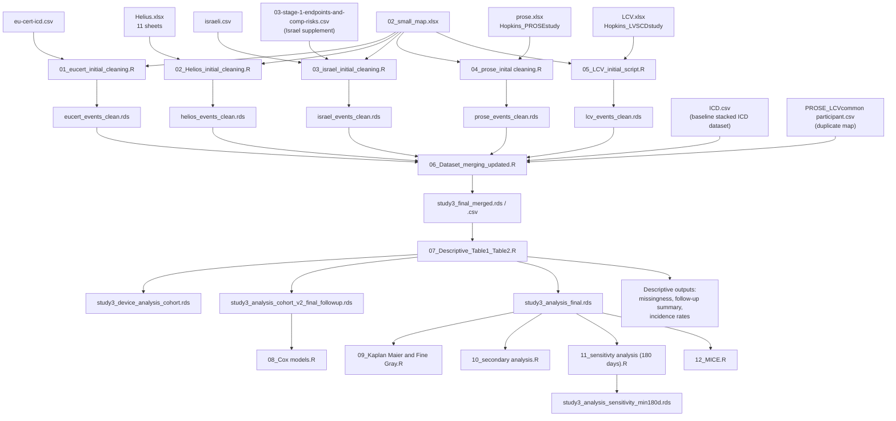

# Study 3 Data Flow

This note reconstructs the actual Study 3 preprocessing and analysis flow from the numbered R scripts in `Study3/`.

## Main Data Flow

## Step-By-Step Pipeline

| Step | Inputs read | Main transformations | Output written |
| --- | --- | --- | --- |
| `01_eucert_initial_cleaning.R` | `eu-cert-icd.csv`, `02_small_map.xlsx` | Renames columns with the small map; parses implant, shock, death, and follow-up dates; derives `days_to_death`, `days_to_app_shock`, `status`, `last_fu_days`, `event_or_censor_date`, `t_followup_days`; keeps only valid ICD types (`VVI`, `DDD`) and age >= 18 if available | `eucert_events_clean.rds` |
| `02_Helios_initial_cleaning.R` | `Helius.xlsx` sheets `target_pop`, `Baseline Characteristics`, `Past Medical History (ICD10)`, `Past Medical History (OPS)`, `Medication (ATC)`, `Lab Data`, `Imaging`, `CMR-Scar and GZ`, `ECG`, `ICD queries`, `Outcome`; `02_small_map.xlsx` | Merges all HELIOS sheets by `PAT_INDEX`; renames via map; converts implant/death/follow-up year fields to numeric; derives `followup_years` and `t_followup_days = followup_years * 365`; keeps only `ICD_1` and `ICD_2`; age >= 18 if available | `helios_events_clean.rds` |
| `03_israel_initial_cleaning.R` | `israeli.csv`, `02_small_map.xlsx`, `03-stage-1-endpoints-and-comp-risks.csv` | Renames via map; derives `death_flag`; parses Israel date strings; derives date-based `days_to_death`, `last_fu_days`, `status`, `t_followup_days`; then overwrites follow-up for matched patients using the validated endpoint supplement: `t_followup_days_israel = Alive_last_FU_days`, and updates `death_flag`/`days_to_death` from `Status_death`; filters to single/dual ICD patterns and age >= 18 | `israel_events_clean.rds` |
| `04_prose_inital cleaning.R` | `prose.xlsx` sheet `Hopkins_PROSEstudy`, `02_small_map.xlsx` | Renames via map; because no calendar follow-up date exists, defines `last_fu_days` as the maximum of observed event times (`days_to_death`, `days_to_app_shock`, `days_to_inapp_shock`); sets `t_followup_days = last_fu_days`; keeps exact device labels `SINGLE - Single` and `DUAL - Dual`; age >= 18 if available | `prose_events_clean.rds` |
| `05_LCV_initial_script.R` | `LCV.xlsx` sheet `Hopkins_LVSCDstudy`, `02_small_map.xlsx` | Renames via map; creates `death_type` and `status`; coerces duration fields to numeric; converts some year-based durations to days; defines `t_followup_days` as the max of `days_to_death`, `time_to_app_therapy`, `time_to_inap_therapy`; age >= 18 if available | `lcv_events_clean.rds` |
| `06_Dataset_merging_updated.R` | All five cleaned event RDS files, `ICD.csv`, `PROSE_LCVcommon participant.csv` | Standardizes the event variable set; adds missing columns as `NA`; labels source registry as `dataset`; stacks event datasets; creates prefixed IDs (`CERT_`, `HELS_`, `ISRL_`, `PRSI_`, `PRSL_..._MRI`) to match `ICD.csv`; merges event data into baseline ICD data by ID; keeps Study 3 datasets only; removes known LCV patients that are duplicated in PROSE | `study3_final_merged.rds`, `study3_final_merged.csv` |
| `07_Descriptive_Table1_Table2.R` | `study3_final_merged.rds` | Restricts to `EUCERT`, `HELIOS`, `PROSE`, `ISRAEL`; derives `device_group` from `icd_type`; normalizes binary comorbidity/medication fields; creates `t_followup_days_final` from `t_followup_days` and preferentially replaces Israel follow-up with `t_followup_days_israel`; builds Table 1, Table 2, follow-up summaries, missingness summaries, incidence rates; derives `event_inapp_shock` via helper | `study3_device_analysis_cohort.rds`, `study3_analysis_cohort_v2_final_followup.rds`, `study3_analysis_final.rds`, plus descriptive CSV outputs |
| `08_Cox models.R` | `study3_analysis_cohort_v2_final_followup.rds` | Reharmonizes `device_group`, creates `event_inapp_shock`, removes rows with `t_followup_days_final <= 0`, builds primary and sensitivity Cox models stratified by `dataset` | no new data table written |
| `09_Kaplan Maier and Fine Gray.R` | `study3_analysis_final.rds` | Recreates `event_inapp_shock`; filters to positive follow-up and non-missing `device_group`; runs KM, log-rank, Fine-Gray, and cumulative incidence analyses; creates `fg_event` | figure and result CSV outputs |
| `10_secondary analysis.R` | `study3_analysis_final.rds` | Creates subgroup variables (`age65`, `lvef30`, `nyha_bin`); runs univariable, multivariable, and interaction Cox models | no new data table written |
| `11_sensitivty analysis (180 days).R` | `study3_analysis_final.rds` | Creates `fu_lt_6mo`; restricts to `t_followup_days_final >= 180`; reruns incidence rates, Cox, KM, Fine-Gray, CIF; creates `fg_event` in the sensitivity cohort | `study3_analysis_sensitivity_min180d.rds` and sensitivity output files |
| `12_MICE.R` | `study3_analysis_final.rds` | Recreates `event_inapp_shock`; prepares factor coding; keeps SAP covariates with <30% missingness for imputation; runs `mice(m = 20)` and then a Cox model on imputed data | no new data table written |

## Follow-Up And Related Time/Event Variables

| Variable | Where created | How it is created |
| --- | --- | --- |
| `days_to_death` | EUCERT, Israel, LCV/source-harmonized | Usually `death_date - icd_implant_date` for deaths; in EUCERT and Israel non-deaths use last follow-up time instead. In Israel it can later be overwritten by the validated endpoint supplement when `Status_death == 1`. |
| `days_to_app_shock` | EUCERT and source-harmonized inputs | In EUCERT it is explicitly calculated as `app_shock_date - icd_implant_date`; other datasets mostly carry it through from the harmonized source field. |
| `days_to_inapp_shock` | Source-harmonized inputs | Usually not newly calculated here; it is brought in from the mapped source data and then used downstream for event QC and capping. |
| `last_fu_days` | EUCERT, Israel, PROSE | EUCERT/Israel: `last_fu_date - icd_implant_date`. PROSE: maximum observed event time because no calendar follow-up date exists. |
| `followup_years` | HELIOS | `death_year - implant_year` for deaths, otherwise `fu_year - implant_year`. |
| `event_or_censor_date` | EUCERT | `death_date` if dead, otherwise `last_fu_date`. |
| `t_followup_days` | All preprocessing scripts | The source-specific main follow-up time in days. Its definition differs by registry: EUCERT uses `event_or_censor_date - implant date`; HELIOS uses `followup_years * 365`; Israel uses death vs last-follow-up days and later the endpoint supplement; PROSE uses `last_fu_days`; LCV uses the max of death/app-therapy/inapp-therapy times. |
| `t_followup_days_israel` | Israel cleaning | Imported from `03-stage-1-endpoints-and-comp-risks.csv` as validated all-cause follow-up (`Alive_last_FU_days`). |
| `t_followup_days_final` | Descriptive script | Starts as numeric `t_followup_days`; for `dataset == "ISRAEL"` it is replaced with `t_followup_days_israel` when available. This is the follow-up variable used in downstream survival analyses. |
| `event_inapp_shock` | `study3_add_inapp_shock_event()` helper, called in scripts 07-12 | Standardizes `inapp_shock_flag` to lowercase and sets `Yes -> 1`, everything else including missing -> `0`. If `days_to_inapp_shock > t_followup_days_final`, the shock time is capped at `t_followup_days_final`. |
| `fg_event` | KM/Fine-Gray and 180-day sensitivity scripts | Competing-risk code: `0 = censored`, `1 = inappropriate shock`, `2 = death before inappropriate shock`. |
| `fu_lt_6mo` | 180-day sensitivity script | Indicator that `t_followup_days_final < 180`. Used only to define the sensitivity exclusion. |

## Which Final Tables Feed Which Analyses

### 1. Final merged preprocessing table

- `study3_final_merged.rds`
- This is the first full Study 3 analysis-ready merge:
  - baseline `ICD.csv` variables
  - cleaned event variables from all five registries
  - duplicate LCV patients removed using the PROSE/LCV overlap file

### 2. Final descriptive cohort

- `dt_desc` and `dt_table2` are built inside `07_Descriptive_Table1_Table2.R` from `study3_final_merged.rds`.
- Saved cohort file:
  - `study3_device_analysis_cohort.rds`
- Main descriptive outputs use this stage plus the later final-follow-up version:
  - Table 1 baseline descriptives
  - Table 2 event/time descriptives
  - missingness summary
  - follow-up summary
  - incidence-rate CSV

### 3. Final downstream survival-analysis cohort

- Saved twice with the same object:
  - `study3_analysis_cohort_v2_final_followup.rds`
  - `study3_analysis_final.rds`
- This is the key final table for regression and time-to-event work.
- It contains:
  - the device-group restriction to single vs dual ICD
  - `t_followup_days_final`
  - standardized `device_group`
  - harmonized baseline/event variables
  - derived `event_inapp_shock`

### 4. Which scripts use which final table

- `08_Cox models.R`
  - reads `study3_analysis_cohort_v2_final_followup.rds`
  - then filters to positive follow-up for Cox models
- `09_Kaplan Maier and Fine Gray.R`
  - reads `study3_analysis_final.rds`
  - then filters to valid survival input before KM/log-rank/Fine-Gray/CIF
- `10_secondary analysis.R`
  - reads `study3_analysis_final.rds`
  - uses it for univariable, multivariable, and subgroup Cox analyses
- `11_sensitivty analysis (180 days).R`
  - reads `study3_analysis_final.rds`
  - restricts to `t_followup_days_final >= 180`
  - saves `study3_analysis_sensitivity_min180d.rds`
- `12_MICE.R`
  - reads `study3_analysis_final.rds`
  - uses it as the base cohort for imputation and the imputed Cox model

## Practical Summary

The main Study 3 data path is:

1. Raw registry-specific event files + `02_small_map.xlsx`
2. Registry-specific cleaned event RDS files
3. Merge into baseline `ICD.csv`
4. Remove non-Study-3 rows and LCV/PROSE duplicate patients
5. Save `study3_final_merged.rds`
6. Create `device_group`, harmonize follow-up into `t_followup_days_final`, derive `event_inapp_shock`
7. Save `study3_analysis_final.rds` / `study3_analysis_cohort_v2_final_followup.rds`
8. Use that final cohort for Cox, KM, Fine-Gray, sensitivity, and MICE analyses
