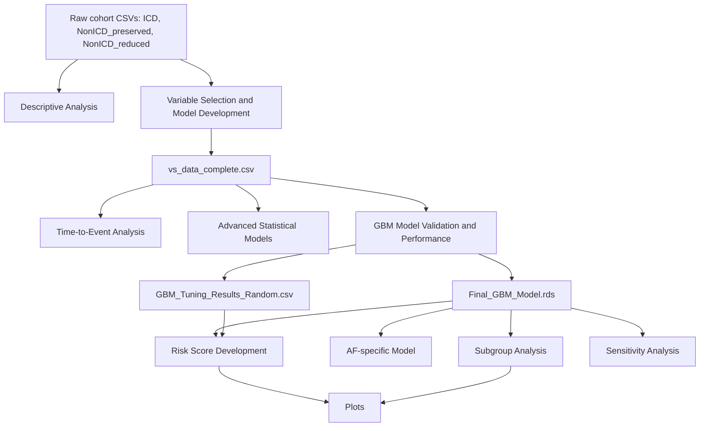

# Study 8 Codebase Description

Generated on: 2026-05-29  
Repository area reviewed: `Study8/`  
Review type: static codebase inspection. The R scripts were read and traced, but the statistical pipeline was not executed.

## 1. Study Purpose

`Study8/` contains an R-based analysis workflow for PROFID Study 8:

> Risk stratification for sudden cardiac death in post-myocardial infarction patients with atrial fibrillation.

The current README identifies the analytical lead as Hassan Raza. The codebase is focused on survival analysis, variable selection, model development, internal validation, risk score construction, subgroup analysis, sensitivity analysis, and manuscript-style plotting.

The main clinical/statistical targets are:

- Sudden cardiac death prediction, generally coded as `Status == 1`.
- Competing mortality or non-SCD events, generally coded as `Status == 2`.
- Censoring, generally coded as `Status == 0`.
- Atrial fibrillation/atrial flutter status through `AF_atrial_flutter`.
- Cohort group comparison across `ICD`, `NonICD_preserved`, and `NonICD_reduced`.

## 2. Top-Level Structure

The reviewed directory contains these main files and subdirectories:

```text
Study8/
  README.md
  AFModel.R
  Advanced Statistical.R
  Risk Score Development.R
  Sensitivity Analysis.R
  SubGroupAnalysis.R
  Variable Selection & Model Development.R
  cox_model_results.csv
  Descriptive Analysis/
    DescriptiveAnalysis.R
  Model Validation and Performance/
    Model Validation and Performance.R
  Plots/
    plots.R
    AUC_TimeDependent.png
    Subgroup_Cindex.png
  Time-to-Event Analysis Framework/
    Time-to-Event Analysis Framework.R
    Time-to-event Analysis FrameWork 2.R
    cox_model_results.csv
    loglog_survival_plot.png
  Variable Selection & Model Development/
    Variable Selection & Model Development.R
```

Important duplication:

- `Study8/Variable Selection & Model Development.R`
- `Study8/Variable Selection & Model Development/Variable Selection & Model Development.R`

These two files are byte-for-byte identical.

## 3. External Data and Path Assumptions

The code is written for a Windows/network-drive environment. Most scripts assume the base path:

```r
T:/PROFID/Study8
```

Several early-stage scripts read raw data from:

```r
S:/AG/f-dhzc-profid/Data Transfer to Charite/ICD.csv
S:/AG/f-dhzc-profid/Data Transfer to Charite/NonICD_preserved.csv
S:/AG/f-dhzc-profid/Data Transfer to Charite/NonICD_reduced.csv
```

The local repository does not include those raw CSV files or the derived `Files/` folders that most downstream scripts expect. As a result, the scripts are not directly reproducible from the checked-in `Study8/` directory alone.

The central derived dataset used by nearly every later script is:

```text
T:/PROFID/Study8/Variable Selection & Model Development/Files/vs_data_complete.csv
```

The central fitted model used by risk score, subgroup, sensitivity, plotting, and AF-specific workflows is:

```text
T:/PROFID/Study8/Model Validation and Performance/Files/Final_GBM_Model.rds
```

The central tuning file used to choose the number of GBM trees and related hyperparameters is:

```text
T:/PROFID/Study8/Model Validation and Performance/Files/GBM_Tuning_Results_Random.csv
```

## 4. Intended Workflow

The codebase is best understood as a staged workflow:



Practical execution order:

1. Run `Variable Selection & Model Development.R` to create the cleaned/imputed modeling dataset and Cox model outputs.
2. Run `Descriptive Analysis/DescriptiveAnalysis.R` for baseline summaries and AF/no-AF descriptive tables.
3. Run one of the time-to-event framework scripts for Cox, PH diagnostics, Fine-Gray, and truncated follow-up analyses.
4. Run `Model Validation and Performance/Model Validation and Performance.R` to tune and save the final GBM model.
5. Run `Risk Score Development.R` to convert the GBM linear predictor into an integer risk score and risk groups.
6. Run `AFModel.R`, `SubGroupAnalysis.R`, and `Sensitivity Analysis.R` for additional validation and robustness analyses.
7. Run `Plots/plots.R` for output figures.

## 5. Script-by-Script Description

### 5.1 `README.md`

The README is minimal and contains only:

- Study title.
- Analytical lead.

It does not currently document setup, dependencies, execution order, input files, outputs, or reproducibility requirements.

### 5.2 `Descriptive Analysis/DescriptiveAnalysis.R`

Purpose:

- Creates baseline descriptive summaries for the three cohorts.
- Compares continuous and categorical variables between groups.
- Adds later revisions focused on AF vs non-AF summaries and SCD rates.

Main operations:

- Reads `ICD.csv`, `NonICD_preserved.csv`, and `NonICD_reduced.csv`.
- Finds columns shared across all three raw data files.
- Adds a `Group` variable with cohort labels.
- Combines all cohorts using `bind_rows`.
- Computes medians and IQRs for numeric variables by group.
- Computes counts and percentages for categorical variables by group.
- Runs Kruskal-Wallis tests for continuous variables across groups.
- Runs chi-square tests for categorical variables across groups.
- Reads `vs_data_complete.csv` for later summaries.
- Summarizes follow-up time by cohort and overall.
- Builds AF vs no-AF tables, including SCD event rates.
- Outputs several CSV files under `T:/PROFID/Study8/Descriptive Analysis/files`.

Key outputs include:

- `median_IQR_by_group.csv`
- `categorical_summary.csv`
- `mann_whitney_results.csv`
- `chi_square_results.csv`
- `Followup_Time_Summary.csv`
- `all_variables_IQR_median_by_group_and_overall.csv`
- `Table1_continuous_AF_vs_NoAF.csv`
- `Table1_categorical_AF_vs_NoAF.csv`
- `Table1_pvalues_continuous_AF_vs_NoAF.csv`
- `Table1_pvalues_categorical_AF_vs_NoAF.csv`
- `SCD_rate_AF_vs_NoAF.csv`

Notes:

- The script uses `View()`, which is interactive and not ideal for batch execution.
- The opening section reads local filenames without full paths, while later sections use `T:/...` paths.
- The comment says "Mann-Whitney U Test", but the implementation uses `kruskal.test`, which is appropriate for more than two groups.

### 5.3 `Variable Selection & Model Development.R`

Purpose:

- Builds the central modeling dataset.
- Performs univariate Cox screening.
- Converts categorical variables.
- Handles missingness and imputation.
- Fits multivariable Cox models.
- Runs exploratory treatment-effect modeling with propensity scores.

Main operations:

- Installs and loads packages including `survival`, `dplyr`, `broom`, `MASS`, `MatchIt`, `tableone`, `mice`, `car`, `survminer`, and `cobalt`.
- Reads the three raw cohort CSV files from the `S:/...` network path.
- Adds `Group` labels and combines cohorts.
- Removes metadata columns such as `X`, `DB`, `ID`, `Time_zero_Y`, `Time_zero_Ym`, `Time_index_MI_CHD`, and `HasMRI`.
- Filters out records with missing `Status`.
- Constructs a survival object using `Surv(Survival_time, Status == 1)`.
- Runs univariate Cox models for all candidate predictors.
- Selects variables with p-value `< 0.20`.
- Documents variable types and unique values before and after categorical conversion.
- Converts pre-specified yes/no, multi-category, and coded variables to factors.
- Calculates missingness proportions.
- Drops variables with more than 80 percent missingness.
- Imputes remaining variables with `mice`, using `m = 1` and `maxit = 5`.
- Forces selected history flags such as `Cancer`, `MI_history`, and `FH_CAD` to `"No"` where missing.
- Adds mandatory variables to the univariate-selected variables: `LVEF`, `Age`, `Diabetes`, and `eGFR`.
- Creates `vs_data_model.csv` and complete-case `vs_data_complete.csv`.
- Fits a full Cox model.
- Performs backward AIC stepwise selection.
- Compares full and stepwise models with a likelihood ratio test.
- Computes numeric correlations and identifies highly correlated variable pairs.
- Drops `LDL` as a proxy if `LDL` and `Cholesterol` are both present and correlated.
- Saves final Cox model outputs and attempts VIF diagnostics.
- Runs propensity score matching examples for:
  - `Anti_coagulant`
  - `Anti_arrhythmic_III`
  - `Beta_blockers`

Key outputs include:

- `Univariate_All.csv`
- `Univariate_Selected_p20.csv`
- `Variable_Types_Before_Imputation.csv`
- `Variable_Types_After_Conversion.csv`
- `Missingness_Summary.csv`
- `vs_data_after_conversion.csv`
- `vs_data_after_imputation.csv`
- `mice_imputation_object.RData`
- `vs_data_model.csv`
- `vs_data_complete.csv`
- `vs_data_complete.RData`
- `Cox_Multivariate_Full_Model.csv`
- `Cox_Multivariate_Full_Model_Summary.txt`
- `Cox_Multivariate_Stepwise_Model.csv`
- `Cox_Multivariate_Stepwise_Model_Summary.txt`
- `Cox_ANOVA_Model_Comparison.csv`
- `Correlation_Matrix.csv`
- `Highly_Correlated_Pairs.csv`
- `Cox_Final_Model.csv`
- `Cox_Final_Model_Summary.txt`
- `Final_Model_VIF.csv`
- Propensity score model, matched data, balance, density, and love-plot outputs.

Important implementation notes:

- The final model object can be undefined if no high-correlation pairs are found, because `final_model` is only assigned inside the `else` branch attached to `if (nrow(high_corr_pairs) == 0)`. If no pairs are detected, the later `summary(final_model)` section can fail.
- The VIF calculation uses `vif(lm(mm ~ 1))`, which is not a standard way to compute VIF for the Cox model design matrix.
- The script mixes data preparation, Cox modeling, and treatment-effect modeling in one long file.
- The duplicate copy inside `Variable Selection & Model Development/` should be consolidated to avoid drift.

### 5.4 `Time-to-Event Analysis Framework/Time-to-Event Analysis Framework.R`

Purpose:

- Performs initial survival analysis directly from the raw three-cohort data.
- Fits simple Cox models.
- Checks proportional hazards.
- Fits time-varying and stratified Cox alternatives.
- Runs Fine-Gray competing-risk models.

Main operations:

- Installs/loads `survival`, `survminer`, `dplyr`, `broom`, and `cmprsk`.
- Reads the three raw cohort files from the `S:/...` path.
- Adds `Group`, combines cohorts, filters missing `Status`, and coerces core fields.
- Defines SCD as `Status == 1`.
- Fits `coxph(Surv(Survival_time, Status == 1) ~ Age + Sex + LVEF + Group)`.
- Saves Cox model hazard ratios to `cox_model_results.csv`.
- Uses `cox.zph` for Schoenfeld proportional hazards testing.
- Saves PH test results and individual Schoenfeld plots.
- Saves a log-log survival plot by `Group`.
- Fits a model with interactions against `Survival_time` as a time-varying coefficient approximation.
- Fits a stratified Cox model using `strata(Group)`.
- Runs Fine-Gray models for SCD and non-SCD on both a 10 percent sample and full data.

Checked-in outputs:

- `Time-to-Event Analysis Framework/cox_model_results.csv`
- `Time-to-Event Analysis Framework/loglog_survival_plot.png`

The same `cox_model_results.csv` is also present at the top of `Study8/`.

### 5.5 `Time-to-Event Analysis Framework/Time-to-event Analysis FrameWork 2.R`

Purpose:

- A later or alternate time-to-event framework built on the cleaned `vs_data_complete.csv`.
- Performs broad Cox modeling, PH diagnostics, Fine-Gray analysis, 120-day truncation, spline adjustment, CIF plots, and LVEF time-varying effect plotting.

Main operations:

- Reads `vs_data_complete.csv`.
- Converts `Survival_time` and `Status` to numeric.
- Creates `event_SCD` and `event_COMP`.
- Fits a Cox model with all available variables via `~ .`.
- Runs `cox.zph` and saves Schoenfeld diagnostics.
- Runs Fine-Gray models after selecting mandatory variables, biomarker variables, ECG variables, and outcomes.
- Drops highly correlated numeric predictors with absolute correlation above 0.80.
- Saves Fine-Gray SCD and non-SCD text outputs.
- Truncates follow-up to 120 days by capping `Survival_time`.
- Fits a 120-day Cox model.
- Saves PH tests, individual Schoenfeld plots, PH violation reports, and spline-adjusted Cox models when needed.
- Generates CIF-style plots for SCD and competing death.
- Fits an explicit time-varying LVEF model using `LVEF * log_time`.
- Saves `LVEF_TimeVarying_Coefficient.png`.

Key outputs include:

- `cox_model_results.csv`
- `schoenfeld_test_results.csv`
- `Schoenfeld_Residuals_All.pdf`
- `Dataset_Truncated120Days.csv`
- `CoxModel_120Days.csv`
- `Schoenfeld_PH_Test_120Days.csv`
- `Schoenfeld_All_120Days.pdf`
- `PH_Violation_Report_120Days.csv`
- `CoxModel_120Days_SplineAdjusted.csv`
- `CoxModel_120Days_SPLINE_Adjusted.csv`
- `CIF_SCD_120Days.png`
- `CIF_CompetingDeath_120Days.png`
- `ModelDiagnostics_120Days.csv`
- `LVEF_TimeVarying_Coefficient.png`
- Fine-Gray text outputs in `Sensitivity Analysis/Files`.

Important implementation notes:

- The script uses `~ .` in Cox models after adding derived outcomes. This can accidentally include event indicators or derived variables as predictors unless explicitly excluded.
- The 120-day truncation block mutates `Survival_time = pmin(Survival_time, 120)` and then defines `Status_120 = ifelse(Survival_time >= 120, 0, Status)`. Because `Survival_time` has already been capped, every observation with capped time equal to 120 is censored. That is probably intended, but the logic should be reviewed carefully.
- The script repeats PH violation reporting and spline adjustment logic several times.

### 5.6 `Advanced Statistical.R`

Purpose:

- Explores machine-learning survival models and PCA:
  - Random survival forest through `ranger`.
  - Survival GBM through `gbm`.
  - Biomarker PCA and visualizations.

Main operations:

- Reads `vs_data_complete.csv`.
- Defines `event_flag = ifelse(Status == 0, 0, 1)`.
- Selects mandatory predictors: `LVEF`, `Age`, `BMI`, `Diabetes`, `eGFR`.
- Adds available biomarkers from a predefined list.
- Adds available ECG variables from a predefined list.
- Splits data into 70 percent training and 30 percent validation using `createDataPartition`.
- Fits a small random survival forest with `num.trees = 10`.
- Saves RSF variable importance and validation predictions.
- Fits a lightweight GBM with `n.trees = 100`.
- Fits an advanced GBM with `n.trees = 1500`, interaction depth 4, shrinkage 0.005, and bag fraction 0.7.
- Saves model objects, variable importance tables, C-index summaries, and plots.
- Runs PCA on the biomarker block if at least two biomarkers are available and enough complete rows exist.
- Saves PCA loadings, scores, variance explained, scree plot, biplot-related objects, and heatmap.

Key outputs under `AdvancedStats/Files_ML` include:

- `Biomarkers_present.csv`
- `ECG_vars_present.csv`
- `RSF_model_light.rds`
- `RSF_Variable_Importance.csv`
- `RSF_Variable_Importance_Top10.png`
- `RSF_Predictions_Validation.csv`
- `RSF_Model_Performance_OnlyEval.csv`
- `GBM_model_light.rds`
- `GBM_Variable_Importance.csv`
- `GBM_Variable_Importance_Top10.png`
- `GBM_Predictions_Validation.csv`
- `GBM_Model_Performance.csv`
- `GBM_model_advanced.rds`
- `GBM_Variable_Importance_Advanced.csv`
- `GBM_Variable_Importance_Top10_Advanced.png`
- `GBM_Predictions_Validation_Advanced.csv`
- `GBM_Model_Performance_Advanced.csv`
- `Biomarker_PCA_Loadings.csv`
- `Biomarker_PCA_Scores.csv`
- `Biomarker_PCA_Scree.png`
- `Biomarker_PCA_VarianceExplained.csv`
- `Biomarker_PCA_Heatmap.png`

Important implementation notes:

- The RSF is explicitly lightweight with only 10 trees, so it is likely exploratory rather than final.
- The script installs packages during execution and repeats `install.packages("ranger")` and `install.packages("Hmisc")`.
- PCA plotting code after the guarded PCA block may reference `pca_res` even if PCA was skipped.

### 5.7 `Model Validation and Performance/Model Validation and Performance.R`

Purpose:

- Tunes, fits, validates, and explains the main GBM survival model.
- Produces the `Final_GBM_Model.rds` used downstream.

Main operations:

- Loads packages including `tidyverse`, `gbm`, `survival`, `Hmisc`, `riskRegression`, `pec`, `rmda`, and `caret`.
- Reads `vs_data_complete.csv`.
- Creates `event_flag = ifelse(Status == 0, 0, 1)`.
- Selects mandatory variables, biomarkers, and ECG variables.
- Splits into 70 percent training and 30 percent validation.
- Converts character/factor variables to numeric for GBM.
- Defines a survival GBM formula with `Surv(Survival_time, event_flag)`.
- Builds a hyperparameter grid:
  - `n.trees`: 500, 1000, 1500
  - `interaction.depth`: 3, 4, 5
  - `shrinkage`: 0.01, 0.005
  - `n.minobsinnode`: 20, 30
  - `bag.fraction`: 0.6, 0.7
- Samples 15 random combinations from the full grid.
- Trains GBM models and evaluates validation C-index.
- Saves the tuning table.
- Chooses the best row by maximum C-index.
- Fits and saves the final GBM model.
- Saves validation C-index and performance summary.
- Performs a 10-fold cross-validation using the best hyperparameters.
- Computes train and validation Harrell C-index.
- Computes integrated Brier score and calibration slope.
- Performs decision curve analysis.
- Attempts to save NRI results.
- Computes SHAP values with `fastshap` and `shapviz`.
- Saves SHAP summary, dependence plots, and importance tables.

Key outputs under `Model Validation and Performance/Files` include:

- `GBM_Tuning_Results_Random.csv`
- `Final_GBM_Model.rds`
- `GBM_Final_Performance.csv`
- `GBM_10Fold_CV_Performance.csv`
- `GBM_Discrimination_CIndex.csv`
- `GBM_Calibration_IBS_Slope.csv`
- `GBM_DCA_Results.csv`
- `GBM_DCA_Plot.png`
- `GBM_NRI_Results.csv`
- `GBM_SHAP_Summary.png`
- `GBM_SHAP_LVEF.png`
- `GBM_SHAP_Age.png`
- `GBM_SHAP_NTProBNP.png`
- `GBM_SHAP_Haemoglobin.png`
- `GBM_SHAP_Triglycerides.png`
- `GBM_SHAP_Importance.csv`

Important implementation notes:

- `best_params` is printed before it is defined in the first tuning/final-model section. That line can fail unless `best_params` already exists in the environment.
- `nri_res` is written to CSV but is not defined in the visible code. That section can fail.
- Factor-to-numeric conversion is performed separately for train and validation. This can create inconsistent numeric encodings if a factor has different levels between splits.
- The risk conversion used in DCA, `1 - exp(-exp(valid_lp))`, is a rough transformation and not tied to a specific time horizon unless calibrated against a baseline hazard.
- The script contains two large phases: model training/validation and SHAP analysis. It resets the environment before SHAP, then reloads required artifacts.

### 5.8 `Risk Score Development.R`

Purpose:

- Converts the final GBM linear predictor into an integer risk score.
- Creates risk groups.
- Validates the risk score.
- Produces risk-score plots, AF-focused figures, and 90-day KM curves.

Main operations:

- Loads `vs_data_complete.csv`, `Final_GBM_Model.rds`, and `GBM_Tuning_Results_Random.csv`.
- Selects best GBM hyperparameters from the tuning file.
- Predicts GBM linear predictor (`LP`) for the full dataset.
- Creates integer `RiskScore` as:

```r
RiskScore <- round((LP - min(LP)) * 5)
```

- Creates tertile-based risk groups:
  - `Low`: below or equal to the 33rd percentile.
  - `Intermediate`: below or equal to the 66th percentile.
  - `High`: above the 66th percentile.
- Saves risk score distribution and dataset with groups.
- Computes time-dependent AUC twice:
  - First with `survAUC::AUC.uno` at 30, 90, 180, 365, 730, and 1095.
  - Then overwrites the same output with `timeROC` at 30, 60, 90, 120, and 150.
- Computes calibration slope using a Cox model with `RiskScore`.
- Computes Brier score using `riskRegression::Score`.
- Generates KM curves by risk group.
- Builds an `rms` nomogram based on `RiskScore`.
- Prints manuscript-style validation summaries.
- Adds later AF-focused plots:
  - AF-only distribution of ICD/EF categories across risk groups.
  - SCD rate with vs without AF across risk groups.
  - 90-day KM-style cumulative event curve by risk group.

Key outputs under `Risk Score Development/Files` and `Risk Score Development/files_2` include:

- `RiskScore_Distribution.csv`
- `RiskScore_with_Groups.csv`
- `AUC_TimeDependent.csv`
- `CalibrationSlope.csv`
- `BrierScore.csv`
- `KM_RiskGroups.png`
- `Nomogram.png`
- `Figure6_AF_only_with_counts.png`
- `Figure6_AF_only_data.csv`
- `Figure_SCD_rate_AF.png`
- `KM_RiskGroups_90Days_CLEAN.png`

Important implementation notes:

- `AUC_TimeDependent.csv` is written twice with different time grids; the second write overwrites the first.
- Comments mix "days" and "months" in different files. This should be clarified globally because `Survival_time` units drive all time-dependent AUC, Brier score, and truncation analyses.
- The integer risk score is min-shifted within the current dataset, so score values are dataset-relative unless the original minimum LP and scale factor are preserved.

### 5.9 `AFModel.R`

Purpose:

- Builds and validates a GBM survival model restricted to AF/atrial flutter patients.

Main operations:

- Reads `vs_data_complete.csv`.
- Converts `AF_atrial_flutter == "Yes"` to 1 and filters to AF patients only.
- Uses the same style of mandatory, biomarker, and ECG predictor selection as the main GBM model.
- Splits AF-only data into 70 percent training and 30 percent validation.
- Converts categorical fields to numeric for GBM.
- Runs a 15-combination random hyperparameter search.
- Fits a final AF-specific GBM.
- Saves the model and tuning results.
- Computes validation C-index.
- Computes calibration slope.
- Estimates integrated Brier score.
- Computes time-dependent AUC at 30, 60, 90, and 120.
- Saves AUC table and AUC plot.
- Saves performance metrics.
- Computes SHAP values on a training subset.
- Saves SHAP summary, forest plot of top predictors, and SHAP importance table.

Key outputs under `AF model/files` include:

- `AF_GBM_Tuning_Results.csv`
- `AF_GBM_Model.rds`
- `AF_TimeDependent_AUC.csv`
- `AF_TimeDependent_AUC_Plot.png`
- `AF_Model_Performance.csv`
- `AF_SHAP_Summary.png`
- `AF_SHAP_ForestPlot.png`
- `AF_SHAP_Importance.csv`

Important implementation notes:

- Time-dependent AUC comments state "30-150 months", while the chosen `times` are 30, 60, 90, and 120. The actual unit depends on `Survival_time`.
- The same factor-to-numeric consistency concern applies here as in the main GBM validation script.

### 5.10 `SubGroupAnalysis.R`

Purpose:

- Evaluates final GBM performance across clinically relevant subgroups.

Main operations:

- Reads `vs_data_complete.csv`.
- Converts `AF_atrial_flutter` to binary.
- Loads `Final_GBM_Model.rds` and best GBM tuning row.
- Defines `run_subgroup()` to:
  - Filter data to a subgroup level.
  - Warn if fewer than five events.
  - Predict GBM linear predictor.
  - Compute C-index.
  - Compute calibration slope.
  - Compute an approximate IBS from Brier-like residuals.
  - Save per-subgroup CSV.
- Runs subgroup analyses for:
  - `Group`: `ICD`, `NonICD_preserved`, `NonICD_reduced`.
  - `AF_atrial_flutter`: 1 vs 0.
  - `CVD_risk_region`: all observed region levels.
  - `Baseline_type`: all observed baseline types.

Key outputs under `SubGroup Analysis/Files` include:

- `Subgroup_Group_ICD.csv`
- `Subgroup_Group_NonICD_preserved.csv`
- `Subgroup_Group_NonICD_reduced.csv`
- AF subgroup files.
- Region subgroup files.
- Baseline type subgroup files.
- `Subgroup_Analysis_AllResults.csv`

Important implementation notes:

- The IBS is a quick approximation, not the same as the time-dependent IBS used elsewhere.
- Subgroups with very few events are kept but marked as unreliable only in console output.

### 5.11 `Sensitivity Analysis.R`

Purpose:

- Runs robustness checks around complete-case analysis, competing risks, temporal robustness, AF definitions, and acute-vs-chronic predictors.

Main operations:

- Loads `vs_data_complete.csv`, `Final_GBM_Model.rds`, and tuning results.
- Computes model performance on complete cases:
  - C-index.
  - Calibration slope.
  - Approximate IBS.
- Saves `Sensitivity_CompleteCase.csv`.
- Runs broader complete-case Cox model with all predictors.
- Runs cause-specific Cox model for SCD.
- Generates CIF-like plots for SCD and competing events.
- Splits data by `Baseline_type` into `MI` and `MI40d`.
- Removes single-level variables before fitting temporal models.
- Creates two AF definitions:
  - `AF_broad`: `AF_atrial_flutter == "Yes"`.
  - `AF_strict`: `AF_atrial_flutter == "Yes" & Anti_coagulant == "Yes"`.
- Evaluates final GBM under AF definition scenarios.
- Compares full acute+chronic predictor Cox model against chronic-only model.
- Saves LP distribution plots for the full and chronic-only models.

Key outputs under `Sensitivity Analysis/Files` include:

- `Sensitivity_CompleteCase.csv`
- `CompleteCase_Dataset.csv`
- `CompleteCase_Cox_Model.csv`
- `CompleteCase_CIndex.csv`
- `CompleteCase_LP_Distribution.png`
- `CauseSpecific_Cox_Model.csv`
- `CauseSpecific_CIndex.csv`
- `CIF_SCD.png`
- `CIF_COMP.png`
- `Temporal_MI_Model.csv`
- `Temporal_MI40d_Model.csv`
- `Sensitivity_AF_AllResults.csv`
- `AF_AF_broad_LP_Distribution.png`
- `AF_AF_strict_LP_Distribution.png`
- `Sensitivity_AcuteVsChronic.csv`
- `LP_Full_AcuteChronic.png`
- `LP_ChronicOnly.png`

Important implementation notes:

- The script has two complete-case analysis sections with partly different modeling assumptions.
- Several Cox models use `~ .`, which can include helper variables unless excluded.
- The approximate IBS calculations differ from the formal `riskRegression::Score` approach used in other scripts.

### 5.12 `Plots/plots.R`

Purpose:

- Creates manuscript-style plots and descriptive tables from previously generated outputs.

Main operations:

- Reads `Risk Score Development/Files/AUC_TimeDependent.csv` and saves `AUC_TimeDependent.png`.
- Reads `SubGroup Analysis/Files/Subgroup_Analysis_AllResults.csv` and saves `Subgroup_Cindex.png`.
- Recomputes risk score from final GBM and saves:
  - Risk score histogram.
  - Risk score by event status.
  - KM curves by risk group.
  - Predicted survival at 150 days.
  - Event rate by risk score.
  - Risk group counts.
  - Risk group by ICD/EF category.
- Creates descriptive summary tables for group-level SCD/AF counts and baseline means.
- Creates fixed bar chart of SCD events with vs without AF across risk groups.

Checked-in plot outputs:

- `Plots/AUC_TimeDependent.png`
- `Plots/Subgroup_Cindex.png`

Important implementation notes:

- One output path is malformed:

```r
OUTDIR <- file.path(BASE, "T:\PROFID\Study8\Plots")
```

This mixes a base path with an escaped Windows path string and is likely not what was intended.

- The script depends on many outputs from prior scripts and is not standalone.

## 6. Data Model and Common Variables

Common outcome/time fields:

- `Survival_time`: follow-up duration. The intended unit should be clarified because comments alternate between days and months.
- `Status`: event code.
- `event_flag`: commonly defined as all nonzero events or as SCD only, depending on script.
- `event_SCD`: SCD event, usually `Status == 1`.
- `event_COMP`: competing event, usually `Status == 2`.

Common grouping fields:

- `Group`: cohort group, with values `ICD`, `NonICD_preserved`, and `NonICD_reduced`.
- `AF_atrial_flutter`: AF/flutter status, usually `"Yes"` vs other values.
- `Baseline_type`: used for temporal robustness, including `MI` and `MI40d`.
- `CVD_risk_region`: region subgroup variable.

Common predictors:

- Mandatory predictors:
  - `LVEF`
  - `Age`
  - `BMI`
  - `Diabetes`
  - `eGFR`

- Biomarkers, when present:
  - `BUN`
  - `Cholesterol`
  - `CRP`
  - `eGFR`
  - `Haemoglobin`
  - `HbA1c`
  - `HDL`
  - `IL6`
  - `LDL`
  - `NTProBNP`
  - `Potassium`
  - `Sodium`
  - `Triglycerides`
  - `Troponin_T`
  - `TSH`

- ECG variables, when present:
  - `HR`
  - `PR`
  - `QRS`
  - `QTc`
  - `AV_block`
  - `AV_block_II_or_III`
  - `LBBB`
  - `RBBB`

## 7. Package Dependencies

Packages referenced across the codebase include:

- Core data manipulation and plotting:
  - `dplyr`
  - `tidyverse`
  - `tidyr`
  - `readr`
  - `ggplot2`
  - `reshape2`
  - `viridis`

- Survival modeling:
  - `survival`
  - `survminer`
  - `cmprsk`
  - `fastcmprsk`
  - `riskRegression`
  - `pec`
  - `survAUC`
  - `timeROC`
  - `rms`

- Machine learning:
  - `gbm`
  - `ranger`
  - `caret`
  - `Hmisc`
  - `fastshap`
  - `shapviz`

- Regression/model utilities:
  - `broom`
  - `MASS`
  - `car`

- Missing data and treatment-effect examples:
  - `mice`
  - `MatchIt`
  - `tableone`
  - `cobalt`

- Clinical utility:
  - `rmda`

Most scripts install packages directly with `install.packages()`. For reproducibility, these dependencies should ideally be moved into a project-level package management solution such as `renv`.

## 8. Checked-In Outputs

Only a small subset of generated outputs is present in the repository:

- `Study8/cox_model_results.csv`
- `Study8/Time-to-Event Analysis Framework/cox_model_results.csv`
- `Study8/Time-to-Event Analysis Framework/loglog_survival_plot.png`
- `Study8/Plots/AUC_TimeDependent.png`
- `Study8/Plots/Subgroup_Cindex.png`

The two checked-in `cox_model_results.csv` files are identical. They contain hazard ratio results for:

- `Age`
- `SexMale`
- `LVEF`
- `GroupNonICD_preserved`
- `GroupNonICD_reduced`

Example interpretation from the checked-in file:

- Age HR is approximately 1.009 per unit increase.
- Male sex HR is approximately 1.53.
- LVEF HR is approximately 0.953 per unit increase.
- Non-ICD preserved and reduced groups have lower hazard ratios than the ICD reference group in this simple model.

## 9. Reproducibility and Maintainability Assessment

Strengths:

- The code covers a broad and clinically relevant survival modeling workflow.
- Most scripts save intermediate and final outputs to disk.
- Key analyses include discrimination, calibration, Brier score, decision curve analysis, SHAP interpretation, subgroup checks, and sensitivity analyses.
- The final GBM artifact is reused consistently by downstream risk-score, subgroup, and sensitivity workflows.
- Several scripts use fixed random seeds, especially `set.seed(2025)`, improving repeatability.

Major reproducibility barriers:

- The raw input data is not included in the repository.
- Most paths are hard-coded to `T:/PROFID/Study8` and `S:/AG/...`.
- There is no project-level dependency lockfile.
- Scripts install packages during execution.
- Several workflows depend on intermediate files created by earlier scripts, but this dependency chain is not encoded in a reproducible pipeline tool.
- There are no automated tests or validation scripts for checking expected outputs.

Code quality and robustness issues:

- Some scripts contain undefined objects, for example `best_params` before assignment and `nri_res`.
- Multiple scripts use `~ .` in Cox models after adding derived helper variables, which can accidentally include outcomes or post-outcome indicators as predictors.
- Event coding is not fully consistent:
  - Some scripts define `event_flag` as `Status != 0`.
  - Others use `Status == 1`.
  - This matters because SCD-specific and all-event models have different interpretations.
- Time units are unclear:
  - Some comments say days.
  - Some comments say months.
  - AUC and truncation analyses depend critically on this.
- Factor-to-numeric encoding for GBM is done separately for training and validation data, which can create inconsistent encodings.
- Several scripts have duplicated sections or evolved analysis fragments in one file.
- Some output filenames or directories differ only by capitalization, such as `files`, `Files`, and `files_2`.
- There are interactive `View()` calls in scripts that otherwise appear intended for batch use.
- Some Unicode/checkmark/emoji console messages are present. They are harmless in RStudio but can cause encoding issues in stricter batch environments.

## 10. Recommended Cleanup

Highest priority:

1. Create a single project configuration file with:
   - `BASE`
   - raw input paths
   - derived output paths
   - event coding definitions
   - survival time unit

2. Replace hard-coded `T:/...` and `S:/...` paths with relative paths or a configurable base path.

3. Standardize event definitions:
   - `event_scd = Status == 1`
   - `event_competing = Status == 2`
   - `event_any = Status != 0`

4. Clarify whether `Survival_time` is measured in days, months, or another unit.

5. Split long scripts into explicit stages:
   - data preparation
   - descriptive summaries
   - Cox modeling
   - GBM training
   - validation
   - risk score
   - subgroup/sensitivity analyses
   - plotting

6. Remove duplicate `Variable Selection & Model Development.R` or keep one as the canonical script.

7. Replace direct `install.packages()` calls with documented dependencies or `renv`.

8. Fix known undefined-object hazards:
   - define `final_model` even when no high-correlation pairs exist
   - remove or implement `nri_res`
   - define `best_params` before printing it

9. Avoid `~ .` in models where derived outcomes/helper variables are present.

10. Store modeling preprocessing rules so categorical encoding is identical across train, validation, and future prediction datasets.

## 11. Suggested Canonical Pipeline

A clearer canonical pipeline would look like this:

```text
01_prepare_data.R
  -> data/processed/vs_data_complete.csv

02_descriptive_tables.R
  -> outputs/descriptive/*.csv

03_time_to_event_models.R
  -> outputs/time_to_event/*.csv, *.png, *.pdf

04_train_main_gbm.R
  -> outputs/model/Final_GBM_Model.rds
  -> outputs/model/GBM_Tuning_Results_Random.csv
  -> outputs/model/performance/*.csv

05_create_risk_score.R
  -> outputs/risk_score/RiskScore_with_Groups.csv
  -> outputs/risk_score/AUC_TimeDependent.csv
  -> outputs/risk_score/*.png

06_af_specific_model.R
  -> outputs/af_model/*.csv, *.rds, *.png

07_subgroup_analysis.R
  -> outputs/subgroups/*.csv

08_sensitivity_analysis.R
  -> outputs/sensitivity/*.csv, *.png

09_manuscript_plots.R
  -> outputs/figures/*.png
```

## 12. Summary

`Study8/` is a mature but script-oriented analysis codebase for SCD risk stratification in post-MI patients, with special attention to atrial fibrillation. Its core workflow builds a cleaned complete-case dataset, trains a tuned survival GBM, validates it, converts its linear predictor into a risk score, and evaluates performance across subgroups and sensitivity settings.

The statistical breadth is substantial, but reproducibility is limited by hard-coded network paths, absent raw and intermediate data, duplicated scripts, undefined-object risks, inconsistent event definitions, and unclear survival-time units. The main next engineering step should be to turn the current scripts into a documented, parameterized, single-entry pipeline with explicit inputs, outputs, and shared definitions.
